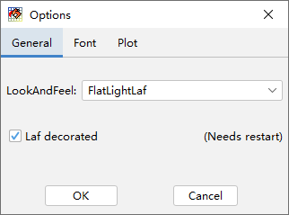
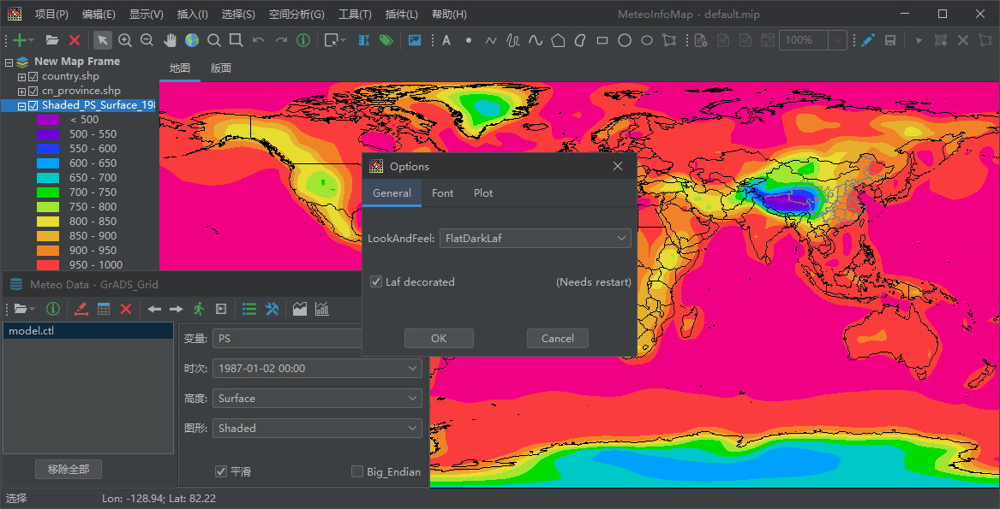

.. docs-meteoinfo-desktop_cn-tools-options:

************************
软件设置选项
************************

点击“工具 -> 选项”菜单打开选项对话框，MeteoInfoMap支持多种皮肤外观，通过修改LookAndFeel选项来更换软件的外观。

比如将LookAndFeel选项修改为FlatDarkLaf，MeteoInfoMap的外观更改为如下图所示。

Font选项卡是对图例、文本字体的设置。Plot选项卡里有双缓冲（Double Buffering）选项，选中该选项图形会绘制到一个图像
中，然后再把图像绘制到屏幕上，绘制速度快，尤其是在用户交互式操作时图形的重绘速度快。不选择双缓冲选项图形会直接绘制到屏
幕上，影响交互式操作时图形的重绘速度，但在高屏幕分辨率电脑上显示更为清晰。