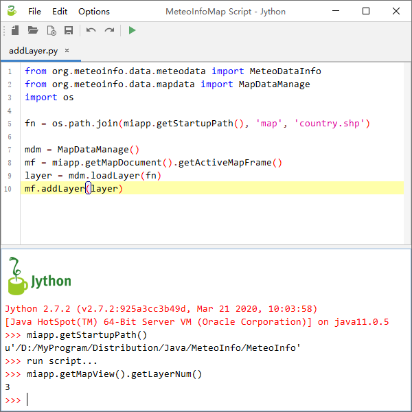

.. docs-meteoinfo-desktop_cn-tools-script:

************************
脚本编辑器
************************

MeteoInfoMap中可以通过编写Jython脚本程序或者命令行输入来实现一些功能。点击“工具 -> 脚本编辑器”菜单打开脚本编辑窗体，
上面可以编辑Jython脚本程序，下面是命令行窗口执行相应的输入命令。MeteoInfo的脚本功能主要在MeteoInfoLab中体现，这里
就不详细讲了。需要注意的是这里引入了miapp变量来表示正在运行的MeteoInfoMap主程序，可以通过这个变量来获取和改变主程序
中的内容。

