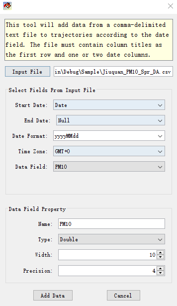

.. docs-trajstat-add_data:

**************************
Add Data to Trajectory
**************************

This tool will add data from a comma-delimited text file to trajectories according to the date field. The file must 
contain column titles as the first row and one or two date columns.

Press 'Add Data to Trajectory' menu to open the following dialog.

.. image:: ../../_static/trajstat/add_data_empty.png

Press ‘Input File’ button, then select the data file 'Jiuquan_PM10_Spr_DA.csv' from the 'Open' dialog. Then set 
'Start Date', 'End Date' (if the samples have start and end time), 'Date Format', 'Time Zone' and ‘Data Field’ from 
the dataset. Then the data field property with name, type, width and precision need to be set. **Please note that 
field name can’t be started with number.**

Press ‘Add Data’ button. Then select the layers in which the data will be added in a ‘Select Trajectory Layers’ dialog. 
Press ok button the measurement data will be added in ‘JiuquanSpr’ layer.

.. image:: ../../_static/trajstat/add_data_sel_layer.png

The attribute table of the trajectory layer ‘JiuquanSpr’ was showed below after ‘PM10’ data were added.

.. image:: ../../_static/trajstat/add_data_table.png