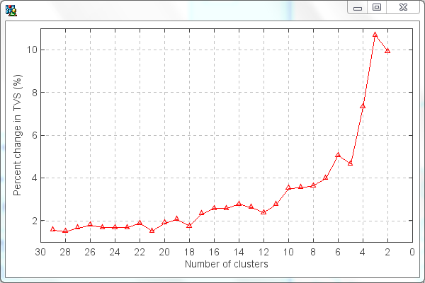

.. docs-trajstat-cluster_cal:

**************************
Cluster Calculation
**************************

A ‘Cluster Calculation’ dialog will be opened when click ‘Cluster Analysis’ menu item. There are two clustering 
options with Euclidean distance or angle distance (Sirois and Bottenheim, 1995). If users only concern the directions 
of the trajectories in clustering, then angle distance should be selected.

The Euclidean distance between two backward trajectories was then given by

.. image:: ../../_static/trajstat/formula_1.gif

Where X1(Y1) and X2(Y2) reference to backward trajectories 1 and 2, respectively. 

The angle distance between two backward trajectories was defined as

.. image:: ../../_static/trajstat/formula_2.gif

where

.. image:: ../../_static/trajstat/formula_3.gif

.. image:: ../../_static/trajstat/formula_5.gif

The variables X0 and Y0 define the position of the studied site. Note that d12 varies between 0 and π. The two extreme 
values occur when two trajectories are in the same and opposite direction, respectively. As defined by equations (2) to 
(5), d12 is the mean angle between the two backward trajectories, as seen from the studied site.

All trajectories must have same number of end points for cluster calculation, so ``Check point number``
button should be pressed firstly, and make sure the result of ``All trajectories have same point number...``.
Otherwise, some trajectories need to be re-calculated due to their abnormal end points numbers.
Normally, the back trajectories in the first days of a month have this problem if the meteorological
data files of last month were not included in calculation.

.. image:: ../../_static/trajstat/cluster_cal.png

Press ‘Calculate Cluster’ button to run the clustering program. Then a .txt file with trajectory number and cluster 
members was created. In this case, maximum cluster number is set to 30 which could be changed if necessary.

.. image:: ../../_static/trajstat/cluster_result.png

Total spatial variation (TSV) can be calculated and plotted by clicking **View TSV** button. The TSV percent change
vs cluster numbers figure can indicate the suitable cluster number before dramatic increasing of TSV percent. Five
cluster was determined by following figure.

‘Eye ball’ method can also be used to determine the cluster number in this software. In ‘Cluster Calculation’ dialog, mean 
trajectories and trajectory number of each cluster could be calculated and to be transferred to ESRI shape file 
according to selected cluster number by pressing ‘ Mean Traj’ button. Several kinds of mean trajectories were calculated 
and showed in map view, and then a suitable cluster number could be determined by your eyes. In this example, Cluster 
number 5 is decided.

.. image:: ../../_static/trajstat/cluster_angle5.png

Set cluster number to 5 in ‘Cluster Calculation’ dialog, and then press ‘Add to Traj’ button. Select layers in opened 
‘Select Trajectory Layers’ dialog. The cluster attribute will be added to the trajectory layers with ‘Cluster’ field.

.. image:: ../../_static/trajstat/cluster_table.png