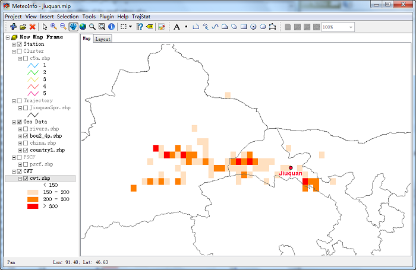

.. docs-trajstat-cwt:

**************************
CWT Analysis
**************************

A limitation of the PSCF method is that grid cells can have the same PSCF value when sample concentrations are 
either only slightly higher or much higher than the criterion. As a result, it can be difficult to distinguish 
moderate sources from strong ones. In the CWT method (Hsu et al., 2003; Seibert et al., 1994), each grid cell is 
assigned a weighted concentration by averaging the sample concentrations that have associated trajectories that 
crossed that grid cell as follows:

.. image:: ../../_static/trajstat/formula_8.png

where Cij is the average weighted concentration in the ijth cell, l is the index of the trajectory, M is the total 
number of trajectories, Cl is the concentration observed on arrival of trajectory l, and τijl is the time spent 
in the ijth cell by trajectory l. A high value for Cij implies that air parcels traveling over the ijth cell would 
be, on average, associated with high concentrations at the receptor. The arbitrary weighting function described 
above was also used in the CWT analyses to reduce the effect of the small values of nij.

Click ‘CWT Analysis’ menu item, and set CWT layer, data field, null data and weighting parameters. Then press 
‘Get Nij’, ‘Cal CWT’ and ‘Weight CWT’ button one by one.

.. image:: ../../_static/trajstat/cwt_analysis.png

Set the color scheme of the cwt layer as below.

.. image:: ../../_static/trajstat/cwt_legend.png

And set line width to 0 in ‘Legend Editor’ dialog. CWT layer looks as blow.

In this case, CWT analysis result is similar with PSCF analysis.