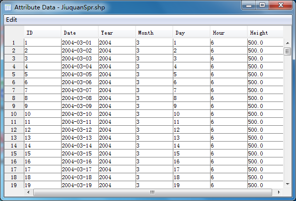

.. docs-trajstat-to_shapefile:

**************************
Convert to Shape File
**************************

Click ‘Convert To Shape File’ menu item. Then select ‘JiuquanSpr.tgs’ file in open dialog.

.. image:: ../../_static/trajstat/open_tgs.png

Then the shape file was created and the shape layer was added in ‘Trajectory’ group.

.. image:: ../../_static/trajstat/converted_shape.png

The attribute table of the created trajectory layer is blow. ‘DATE’ and ‘Height’ field was added to each trajectory.

