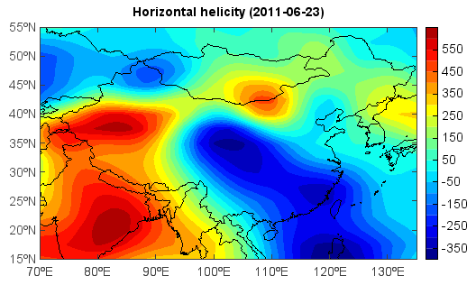

.. _examples-meteoinfolab-meteo_analysis-hori_heli:

*******************
Horizontal helicity
*******************

The example to calcluate horizontal helicity.

::

    print 'Open data files...'
    f_uwnd = addfile('D:/Temp/nc/uwnd.2011.nc')
    f_vwnd = addfile('D:/Temp/nc/vwnd.2011.nc')

    print 'Calculate average wind field from 850 to 600 hpa...'
    tidx = 173    # Jun 23, 2011
    t = f_uwnd.gettime(tidx)
    level = [850,600]    # 850 - 600 hPa
    lat = [15,55]
    lon = [70,135]
    uvar = f_uwnd['uwnd']
    vvar = f_vwnd['vwnd']
    uwnd = uvar[tidx,level,lat,lon]
    vwnd = vvar[tidx,level,lat,lon]
    uc = uwnd.ave()
    vc = vwnd.ave()
    sp = magnitude(uwnd, vwnd)
    speed = sp.ave()
    #speed = magnitude(uc, vc)
    direc = atan2(vc, uc)
    cdirec = direc-40./180.*3.14159
    if cdirec < -3.14159:
        cdirec=cdirec+3.14159*2
    cuc = speed*cos(cdirec)
    cvc = speed*sin(cdirec)

    print 'Calculate horizontal helicity...'
    Hrs = 0.
    zHrs = 0.
    hh = 6
    while hh <= 10:
        zHrs = (uvar[tidx,hh+1,lat,lon]-cuc)*(vvar[tidx,hh,lat,lon]-cvc)- \
            (uvar[tidx,hh,lat,lon]-cuc)*(vvar[tidx,hh+1,lat,lon]-cvc)
        Hrs = Hrs+zHrs
        hh += 1
    Hrs = Hrs[::-1,:]

    print 'Plot...'
    axesm()
    mlayer = shaperead('D:/Temp/map/country1.shp')
    geoshow(mlayer, edgecolor='black')
    layer = contourfm(Hrs, 20)
    title('Horizontal helicity (' + t.strftime('%Y-%m-%d') + ')')
    colorbar(layer)
    
