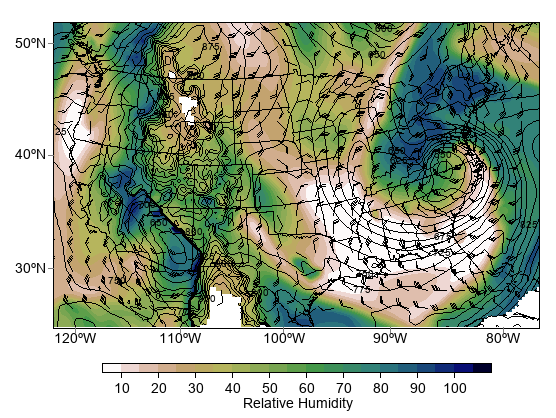

.. _examples-meteoinfolab-meteo_analysis-isentropic_analysis:

***************************************
Isentropic Analysis
***************************************

The meteolib function ``isentropic_interpolation`` allows for isentropic analysis from model analysis
data in isobaric coordinates.

::

    fn = 'D:/Temp/nc/narr_example.nc'
    f = addfile(fn)
    pres = f['isobaric'][:]
    tmpk = f['Temperature'][:]
    u_wind = f['u_wind'][:]
    v_wind = f['v_wind'][:]
    sh = f['Specific_humidity'][:]
    y = tmpk.dimvalue(-2)
    x = tmpk.dimvalue(-1)

    isentlevs = [296.]
    pres, tmpk, u_wind, v_wind, sh = meteolib.isentropic_interpolation(isentlevs, pres,
        tmpk, u_wind, v_wind, sh, temperature_out=True)
    rh = meteolib.relative_humidity_from_specific_humidity(pres, tmpk, sh) * 100

    #plot
    axesm(projinfo=f.proj)
    geoshow('us_states')
    geoshow('country')
    # Plot rh
    levs = arange(10., 106, 5)
    grh = contourf(x, y, rh[0], levs, cmap='MPL_gist_earth_r', proj=f.proj)
    colorbar(grh, orientation='horizontal', aspect=40, shrink=0.8,
        label='Relative Humidity')
    # Plot the surface
    clevisent = arange(0, 1000, 25)
    cs = contour(x, y, pres[0], clevisent, colors='k', linewidths=1.0, proj=f.proj)
    clabel(cs, fontsize=10, fmt='%i', drawshadow=False)
    # Plot wind barbs
    xx, yy = meshgrid(x, y)
    wind_slice = slice(None, None, 6)
    barbs(xx[wind_slice,wind_slice], yy[wind_slice,wind_slice], u_wind[0,wind_slice,wind_slice], v_wind[0,wind_slice,wind_slice],
        size=6, proj=f.proj)

    axis([-122, -75, 25, 50])
    
