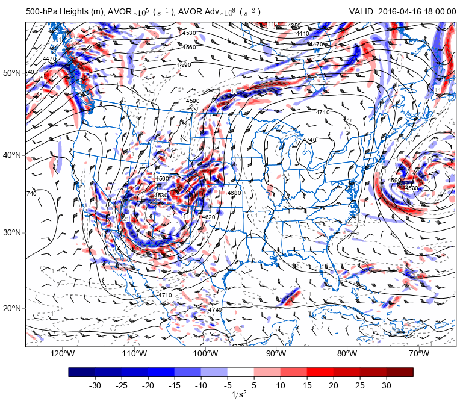

.. _examples-meteoinfolab-meteo_analysis-vorticity_advection:

***************************************
Vorticity Advection
***************************************

Plot an 500-hPa map with calculating vorticity advection using ``meteolib`` calculations.

::

    print('Read data...')
    fn = 'D:/Temp/grib/namanl_218_20160416_1800_000.grb'
    f = addfile(fn)

    vtime = f.gettime(0)
    lev_500 = where(f['isobaric'][:]==500)[0][0]

    xy_slice = slice(None, None, 2)
    hght_500 = f['Geopotential_height_isobaric'][0,lev_500,xy_slice,xy_slice]
    hght_500 = imagelib.gaussian_filter(hght_500, sigma=3)

    uwnd_500 = f['u-component_of_wind_isobaric'][0,lev_500,xy_slice,xy_slice]
    vwnd_500 = f['v-component_of_wind_isobaric'][0,lev_500,xy_slice,xy_slice]

    x = f['x'][xy_slice] * 1000
    y = f['y'][xy_slice] * 1000
    xx, yy = meshgrid(x, y)

    print('Calculate...')
    dx = diff(xx, 1)
    dy = diff(yy, 0)
    avor = meteolib.vorticity(uwnd_500, vwnd_500, dx, dy)
    avor = imagelib.gaussian_filter(avor, sigma=3)
    vort_adv = meteolib.advection(avor, u=uwnd_500, v=vwnd_500, dx=dx, dy=dy) * 1e9

    print('Plot...')
    ax = axesm(projinfo=f.proj)
    geoshow('us_states', edgecolor=(0,102,204))
    geoshow('country', edgecolor=(0,102,204))

    # Plot Titles
    left_title(r'500-hPa Heights (m), AVOR$*10^5$ ($s^{-1}$), AVOR Adv$*10^8$ ($s^{-2}$)')
    right_title('VALID: {}'.format(vtime))

    # Plot Colorfill of Vorticity Advection
    clev_avoradv = np.arange(-30, 31, 5)
    cf = contourf(x, y, vort_adv, clev_avoradv[clev_avoradv != 0],
                     cmap='BlWhRe', smooth=False, proj=f.proj)
    colorbar(cf, orientation='horizontal', shrink=0.8, aspect=40, label=r'$1/s^2$')

    # Plot Height Contours
    cs = contour(x, y, hght_500, 20, colors='black', proj=f.proj)
    clabel(cs, fontsize=10, fmt='%i')

    # Plot Absolute Vorticity Contours
    clevvort500 = np.arange(-9, 51, 10)
    cs2 = contour(x, y, avor*1e5, clevvort500, colors='gray',
                     linewidth=1.25, linestyle='--', proj=f.proj)
    clabel(cs2, fontsize=10, fmt='%i')

    # Plot Wind Barbs
    # Transform Vectors and plot wind barbs.
    wind_slice = slice(None, None, 10)
    barbs(x[wind_slice], y[wind_slice], uwnd_500[wind_slice,wind_slice],
        vwnd_500[wind_slice,wind_slice], size=6, proj=f.proj)

    axis([-125, -65, 15, 58])
    
