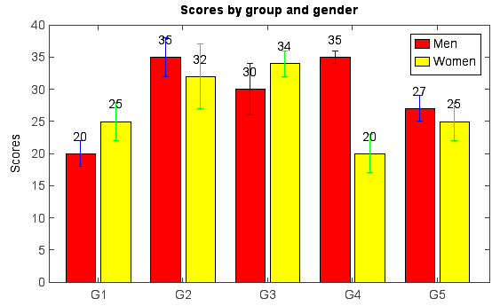

.. _examples-meteoinfolab-plot_types-bar:

*******************
Bar chart
*******************

Bar chart was created by ``bar()`` function. The bar width in the chart was decided automatically
according to data series number.

::

    menMeans = [20, 35, 30, 35, 27]
    bar(menMeans, color='r', label='Men')
    womenMeans = [25, 32, 34, 20, 25]
    bar(womenMeans, color='y', label='Women')
    ylim(0, 40)
    ylabel('Mean age')
    xticks(arange(1, len(menMeans) + 1), ['G1','G2','G3','G4','G5'])
    legend()
    title('Bar chart example')
    
.. image:: ../../../_static/bar_1.png

The bar width and plot position could be set manually with x array and *width* argument.

::

    menMeans = [20, 35, 30, 35, 27]
    n = len(menMeans)
    ind = arange(n)
    width = 0.35
    gap = 0.06
    bar(ind, menMeans, width, color='r', label='Men')

    womenMeans = [25, 32, 34, 20, 25]
    bar(ind + width + gap, womenMeans, width, color='y', label='Women')
    
    xlim(-0.2, 5)
    ylim(0, 40)
    ylabel('Mean age')
    xticks(ind + width + gap / 2, ['G1','G2','G3','G4','G5'])
    legend()
    title('Bar chart example')
    
.. image:: ../../../_static/bar_2.png

Y error bar and text labels on bars:

::

    menMeans = [20, 35, 30, 35, 27]
    std_men = (2, 3, 4, 1, 2)
    n = len(menMeans)
    ind = arange(n)
    width = 0.35
    gap = 0.06
    bar(ind, menMeans, width, yerr=std_men, color='r', ecolor='b', label='Men')
    for j in range(n):
        text(ind[j] + width / 4, menMeans[j] + 2, str(menMeans[j]))

    womenMeans = [25, 32, 34, 20, 25]
    std_women = (3, 5, 2, 3, 3)
    bar(ind + width + gap, womenMeans, width, yerr=std_women, color='y', ecolor='g', label='Women')
    for j in range(n):
        text(ind[j] + + width + gap + width / 4, womenMeans[j] + 2, str(womenMeans[j]))

    xlim(-0.2, 5)
    ylim(0, 40)
    ylabel('Scores')
    xticks(ind + width + gap / 2, ['G1','G2','G3','G4','G5'])
    legend()
    title('Scores by group and gender')
    
