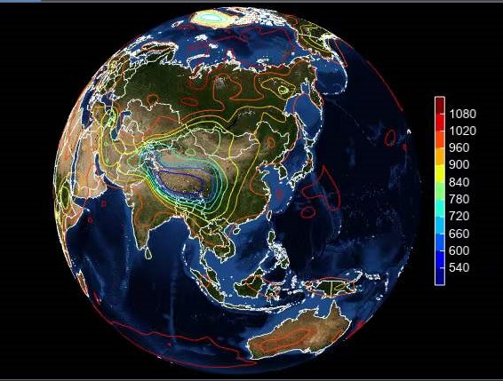
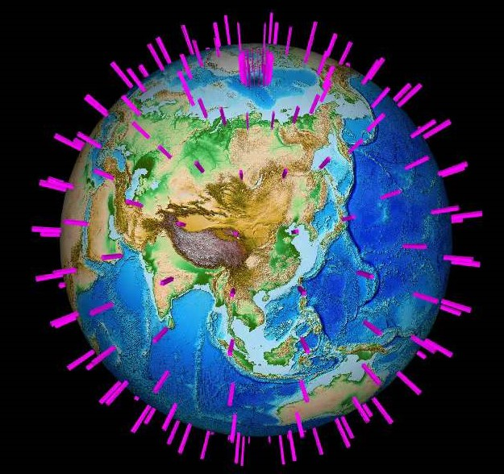
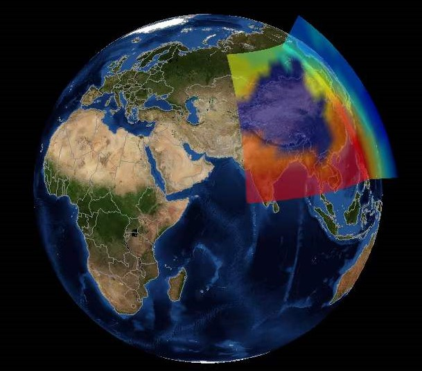

.. _examples-meteoinfolab-plot_types-plot_3d_earth:

**********************
Earth global 3-D plots
**********************

Create an earth global 3D axes (EarthAxes3D object) using ``axes3d(earth=True)`` function.

**Contour on 3D earth**::

    fn = os.path.join(migl.get_sample_folder(), 'GrADS', 'model.ctl')
    f = addfile(fn)
    data = f['PS'][0]
    lat = data.dimvalue(0)
    lon = data.dimvalue(1)

    ax = axes3d(earth=True)
    geoshow('country', edgecolor='gray')
    contour(lon, lat, data, 10, offset=0)
    colorbar(tickcolor='w', xshift=50)
    

**Bars on 3D earth**::

    fn = os.path.join(migl.get_sample_folder(), 'GrADS', 'model.ctl')
    f = addfile(fn)
    data = f['PS'][0,::4,::4]
    lat = data.dimvalue(0)
    lon = data.dimvalue(1)
    lon, lat = meshgrid(lon, lat)

    ax = axes3d(earth=True, image='etopo1.jpg')
    lighting()
    bar3(lon, lat, data, color='m', edgecolor=None, width=1)
    

**Slices on 3D earth**::

    fn = os.path.join(migl.get_sample_folder(), 'GrADS', 'model.ctl')
    f = addfile(fn)
    data = f['T'][0,:,'10:60','70:140']
    levels = data.dimvalue(0)
    height = meteolib.pressure_to_height_std(levels) / 10
    lat = data.dimvalue(1)
    lon = data.dimvalue(2)

    ax = axes3d(earth=True)
    geoshow('country', edgecolor='gray')
    slice3(lon, lat, height, data, 10, xslice=[120], zslice=[300], facecolor='interp',
        edgecolor=None, alpha=0.5)
    

**Stream slice on 3D earth**::

    fn = os.path.join(migl.get_sample_folder(), 'GrADS', 'model.ctl')
    f = addfile(fn)
    u = f['U'][0]
    v = f['V'][0]
    levels = u.dimvalue(0)
    height = meteolib.pressure_to_height_std(levels) / 10
    lat = u.dimvalue(1)
    lon = u.dimvalue(2)
    w = zeros(u.shape)
    speed = sqrt(u*u + v*v)

    ax = axes3d(earth=True)
    geoshow('country', edgecolor='gray')
    levs = arange(2, 20, 2)
    streamslice(lon, lat, height, u, v, w, speed, levs=levs, zslice=[300],
        interval=10)
    colorbar(tickcolor='w', xshift=80)

.. image:: ../../../_static/earth_streamslice.jpg