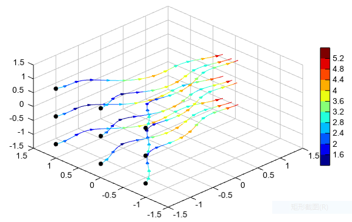

.. _examples-meteoinfolab-plot_types-streamline:

*******************
Streamline plot
*******************

Streamline plot was created by ``streamplot()`` function.

::

    fn = os.path.join(migl.get_sample_folder(), 'GrADS', 'model.ctl')
    f = addfile(fn)
    u = f['U'][0,'500','10:60','60:140']
    v = f['V'][0,'500','10:60','60:140']
    
    #Plot
    axesm()
    geoshow('country', edgecolor='k')
    layer = streamplotm(u, v)
    title('Streamline plot example')
    yticks([20,40,60])
    
.. image:: ../../../_static/streamline.png

3D streamline plot was created by ``streamplot3()`` function.

::

    # Make the grid
    x, y, z = meshgrid(arange(-1.5, 1.5, 0.1),
                       arange(-1.5, 1.5, 0.1),
                       arange(-1.5, 1.5, 0.1))

    # Make the direction data for the arrows
    u = x + cos(4*x) + 3         # x-component of vector field
    v = sin(4*x) - sin(2*y)      # y-component of vector field
    w = -z                       # z-component of vector field
    speed = sqrt(u*u + v*v + w*w)

    sx, sy, sz = meshgrid([-1.5], [-1,0,1], [-1,0,1])

    qq = streamplot3(x[0,0,:], y[0,:,0], z[:,0,0], u, v, w, speed, linewidth=1,
        density=4, interval=10, start_x=sx, start_y=sy, start_z=sz)
    scatter3(sx, sy, sz, c='k')
    colorbar(qq)
    xlim(-1.5, 1.5)
    ylim(-1.5, 1.5)
    zlim(-1.5, 1.5)

Plot streamlines in slice planes.

::

    # Make the grid
    x, y, z = meshgrid(arange(-1.5, 1.6, 0.1),
                       arange(-1.5, 1.6, 0.1),
                       arange(-1.5, 1.6, 0.1))

    # Make the direction data for the arrows
    u = x + cos(4*x) + 3         # x-component of vector field
    v = sin(4*x) - sin(2*y)      # y-component of vector field
    w = -z                       # z-component of vector field
    speed = sqrt(u*u + v*v + w*w)

    streamslice(x, y, z, u, v, w, xslice=1.5, yslice=1.5, zslice=-1.5,
        color='b', linewidth=1, density=4, interval=5)
    xlim(-1.5, 1.5)
    ylim(-1.5, 1.5)
    zlim(-1.5, 1.5)

.. image:: ../../../_static/streamslice.png