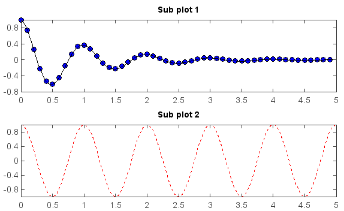
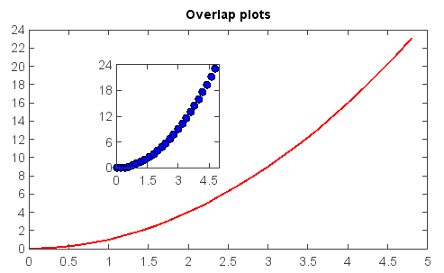

.. _examples-meteoinfolab-plot_types-subplot:

*******************
Sub-plot
*******************

The ``subplot()`` function was used to create multiple plots in one figure with same axes 
areas.

::

    def f(t):
        return exp(-t) * cos(2*pi*t)

    t1 = arange(0., 5., 0.1)
    t2 = arange(0., 5., 0.02)

    subplot(2,1,1)
    plot(t1, f(t1), 'bo', t2, f(t2), 'k')
    title('Sub plot 1')

    subplot(2,1,2)
    plot(t2, cos(2*pi*t2), 'r--')
    title('Sub plot 2')
    

If you want to place an axes manually, i.e.,not on a rectangular grid, use the **axes()** 
command, which allows you to specify the location as ``axes(position=[left, bottom, width, height])`` 
where all values are in fractional (0 to 1) coordinates.

::

    x = arange(0., 5., 0.2)
    y = x**2
    plot(x, y, label='Series_1', linewidth=2.0)
    title('Overlap plots')
    axes(position=[0.3,0.4,0.2,0.4])
    plot(x, y, 'bo')
    
