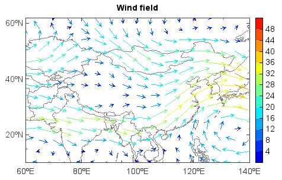

.. _examples-meteoinfolab-plot_types-vector:

*******************
Vector plot
*******************

Vector plot was created by ``quiver()`` or ``quiverm()`` (for map axes) function.

::

    f = addfile('D:/Temp/GrADS/model.ctl')
    u = f['U'][0,[500],[10,60],[60,140]]
    v = f['V'][0,[500],[10,60],[60,140]]
    speed = sqrt(u*u+v*v)
    axesm()
    mlayer = shaperead('D:/Temp/map/country1.shp')
    geoshow(mlayer)
    layer = quiverm(u, v, speed, 10, size=8)
    title('Wind field')
    yticks([20,40,60])
    colorbar(layer)
    
