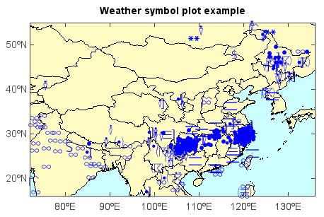

.. _examples-meteoinfolab-plot_types-weather_symbol:

*******************
Weather symbol plot
*******************

Weather symbol plot was created by ``scatterm()`` function with weather specific legend
created by ``weatherspec()`` function.

::

    #Add file and read data array
    f = addfile_micaps('D:/Temp/micaps/10101414.000')
    data = f['WeatherNow'][:]
    lon = f['Longitude'][:]
    lat = f['Latitude'][:]
    #Plot
    axesm(bgcolor=(204,255,255))
    lworld = shaperead('D:/Temp/map/country1.shp')
    lchina = shaperead('D:/Temp/map/bou2_4p.shp')
    geoshow(lworld, edgecolor='k', facecolor=(255,251,195))
    geoshow(lchina, edgecolor='k')
    ls = weatherspec()
    layer = scatterm(lon, lat, data, symbolspec=ls)
    yticks([20,30,40,50])
    title('Weather symbol plot example')
    xlim(72, 136)
    ylim(16, 55)
    
