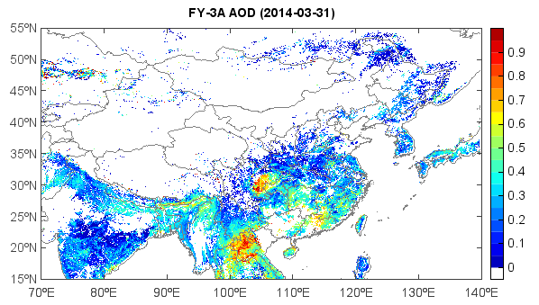

.. _examples-meteoinfolab-satellite-fy3a_aod:

*******************
FY-3A AOD data
*******************

This example code illustrates how to access and visualize a FY-3A satellite AOD 
(Aerosol Optical Depth) data. It's global data with 0.05 degree resolution.

::

    #Add data file
    fn = 'D:/Temp/hdf/FY3A_MERSI_GBAL_L3_ASL_MLT_GLL_20140331_AOAM_5000M_MS.HDF'
    f = addfile(fn)
    #Get data variable
    v = f['Aerosol_Optical_Thickness_of_MERSI_550nm']
    #Set x/y
    x = arange1(-30.0,7200, 0.05)
    y = arange1(-90.0,3600, 0.05)
    #Set x/y dimensions
    v.setdim('Y', y, 0)
    v.setdim('X', x, 1)
    #Get data array
    aod = v[:,:]
    #aod = v[[15, 55],[70, 140]]
    aod = aod[::-1,:] / 10000.
    aod = aod[[15, 55],[70, 140]]
    #Plot
    axesm()
    world = shaperead('D:/Temp/map/country1.shp')
    china = shaperead('D:/Temp/map/bou2_4p.shp')
    geoshow(china, edgecolor='gray')
    geoshow(world)
    levs = arange1(0, 20, 0.05)
    cols = makecolors(len(levs)+1, cmap='matlab_jet')
    cols[0] = 'w'
    layer = imshowm(aod, levs, colors=cols)
    colorbar(layer)
    title('FY-3A AOD (2014-03-31)')
    
