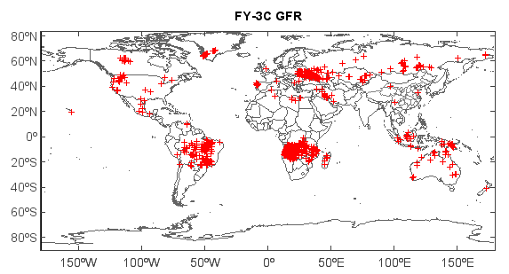

.. _examples-meteoinfolab-satellite-fy3c_gfr:

*******************
FY-3C global fire data
*******************

This example code illustrates how to access and visualize a FY-3C satellite global fire
data.

::

    #Add data file
    fn = 'D:/Temp/hdf/FY3C_VIRRX_GBAL_L2_GFR_MLT_GLL_20150811_POAD_1000M_MS.HDF'
    f = addfile(fn)
    
    #Get data variable
    v = f['FIRES']
    
    #Get data array
    data = v[:,5]
    lat = v[:,3]
    lon = v[:,4]
    
    #Plot
    axesm()
    geoshow('cn_province', edgecolor='gray')
    geoshow('country', edgecolor=(100,100,100))
    layer = scatter(lon, lat, data, s=3, colors=['r'], edge=False, marker='+')
    #colorbar(layer)
    title('FY-3C GFR')
    axism()
    
