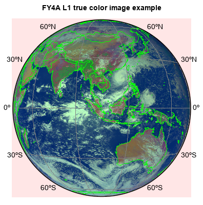
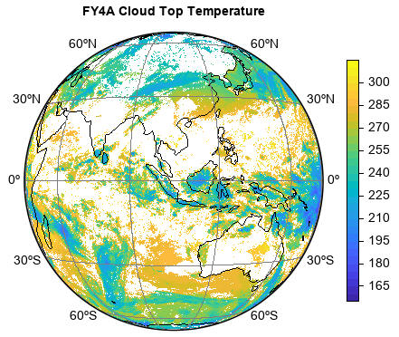

.. _examples-meteoinfolab-satellite-fy4a_agri:

*******************
FY-4A AGRI data
*******************

This example code illustrates how to access and visualize a FY-4A L1 satellite data. Channel 1 (470nm), channel 2
(650nm) and channel 3 (830nm) data are used to composite a true color image.

::

    fn = 'D:/Temp/LaSW/airship/FY4A/FY4A-_AGRI--_N_DISK_1047E_L1-_FDI-_MULT_NOM_20221031060000_20221031061459_4000M_V0001.HDF'
    f = addfile(fn)

    B = f['NOMChannel01'][::-1]
    G = f['NOMChannel02'][::-1]
    R = f['NOMChannel03'][::-1]
    B = B / 4095.
    G = G / 4095.
    R = R / 4095.
    B[B>1] = nan
    G[G>1] = nan
    R[R>1] = nan
    R_G = R / G
    R = R * 0.8
    R1 = R.copy()

    C = R_G > 2
    R[C] = G
    G[C] = R1

    x = linspace(-5496000.0,5496000.0, 2748)
    y = linspace(-5496000.0,5496000.0, 2748)

    #Plot
    proj = projinfo(proj='geos', lon_0=104.7, height=35786000.0)
    figure()
    axesm(projection=proj, gridlabelloc='all', griddx=30,
        griddy=30, gridline=True, frameon=False)
    geoshow('country', edgecolor='g')
    layer = imshow(x, y, [R,G,B], interpolation='bilinear', proj=proj)
    #Adjust image
    imagelib.hsb_adjust(layer, h=0, s=0.1, b=0.3)
    title('FY4A L1 true color image example')
    

The example to read and plot FY4A l2 CTT data.

::

    fn = 'D:/Temp/FY/FY4A-_AGRI--_N_DISK_1047E_L2-_CTT-_MULT_NOM_20190209140000_20190209141459_4000M_V0001.NC'
    f = addfile(fn)
    x = linspace(-5496000.0,5496000.0, 2748)
    y = linspace(-5496000.0,5496000.0, 2748)
    data = f['CTT'][::-1,:]
    data[data>1000] = nan
    data[data==-999] = nan
    height = f['nominal_satellite_height'][:]

    #Plot
    lon0 = 104.7
    ax = axesm(proj='geos', lon_0=lon0, h=height, gridlabelloc='all', griddx=30,
        griddy=30, gridline=True, frameon=False)
    geoshow('coastline', color='k')
    levs = arange(160, 311, 5)
    layer = imshow(x, y, data, levs, proj=ax.proj)
    colorbar(layer, shrink=0.8, xshift=15)
    title('FY4A Cloud Top Temperature')

