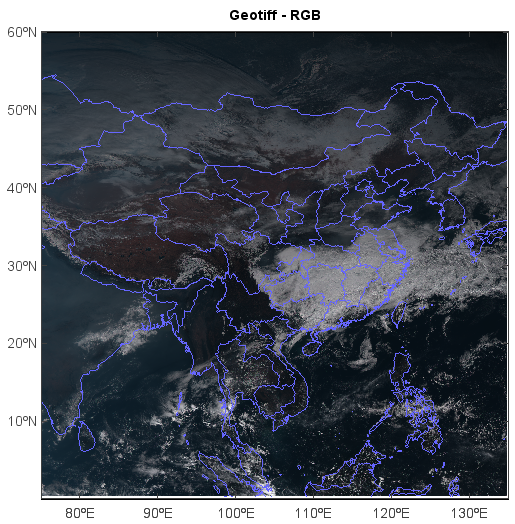

.. _examples-meteoinfolab-satellite-geotiff_rgb:

*******************
GeoTiff RGB image
*******************

This example code illustrates how to plot a GeoTiff RGB image.

::

    f = addfile('D:/Temp/satellite/PI_H08_20151224_0450_TRC_CHN_R10_PGPFD.tif')
    data = f['var'][None]
    axesm()
    geoshow('country', edgecolor=[102,102,255])
    geoshow('cn_province', edgecolor=[102,102,255])
    layer = imshow(data)
    title('Geotiff - RGB')
    
