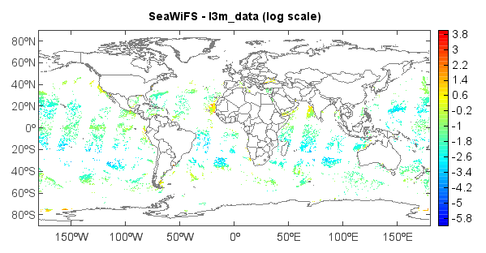

.. _examples-meteoinfolab-satellite-seawifs_grid:

*******************
SeaWiFS grid data
*******************

This example code illustrates how to access and visualize a SeaWiFS grid data.

::

    #Add data file
    f = addfile('D:/Temp/hdf/S1999001.L3m_DAY_CHL_chlor_a_9km.hdf')
    #Get data variable
    vname = 'l3m_data'
    v = f[vname]
    #Set x/y
    ny = f.attrvalue('Number_of_Lines')[0]
    nx = f.attrvalue('Number_of_Columns')[0]
    sx = f.attrvalue('Westernmost_Longitude')[0]
    ex = f.attrvalue('Easternmost_Longitude')[0]
    sy = f.attrvalue('Southernmost_Latitude')[0]
    ey = f.attrvalue('Northernmost_Latitude')[0]
    x = linspace(sx, ex, nx)
    y = linspace(sy, ey, ny)
    #Set x/y dimensions
    v.setdim('Y', y, 0)
    v.setdim('X', x, 1)
    #Get data array
    fillv = v.attrvalue('Fill')[0]
    scale = v.attrvalue('Slope')[0]
    offset = v.attrvalue('Intercept')[0]
    data = v[::-1,:] * scale + offset
    data.fill_value = fillv
    data = log(data)
    #Plot
    axesm()
    world = shaperead('D:/Temp/map/country1.shp')
    geoshow(world)
    levs = arange(-6, 4, 0.2)
    layer = imshowm(data, levs)
    colorbar(layer)
    title('SeaWiFS - ' + vname + ' (log scale)')
    
