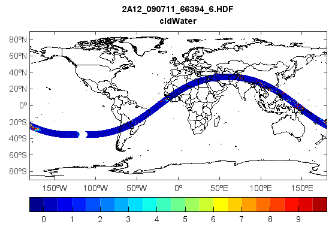

.. _examples-meteoinfolab-satellite-trmm_2a12:

*******************
TRMM 2A12 data
*******************

This example code illustrates how to access and visualize a TRMM 2A12 data.

::

    #Add data file
    folder = 'D:/Temp/hdf/'
    fns = '2A12_090711_66394_6.HDF'
    fn = folder + fns
    f = addfile(fn)
    #Get data variable
    geo = f['geolocation']
    lat = geo[:,:,0]
    lon = geo[:,:,1]
    vname = 'cldWater'
    water = f[vname][:,:,9]
    water = water / 1000
    #Plot
    axesm()
    geoshow('country', edgecolor='k')
    levs = arange(0, 10, 0.5)
    layer = pcolor(lon, lat, water, levs)
    colorbar(layer, orientation='horizontal')
    title([fns, vname])
    axism([-180, 180, -90, 90])
    
