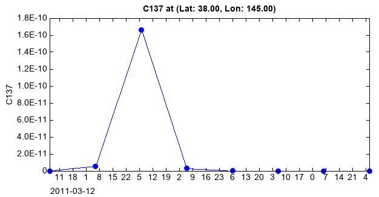

.. _examples-meteoinfolab-trajectory-hyconc_plot:

**********************************
HYSPLIT output concentration plot
**********************************

Get a HYSPLIT output concentration data file object using **addfile_hyconc** function, and 
then read 2D array for filled contour plot. Following is an example of cesium-137 simulation
during 2011 Fukushima nuclear disaster.

::

    fn = r'D:\Working\MIScript\JapanNuclear\cdump15'
    f = addfile_hyconc(fn)
    tidx = 5
    data = f['C137'][tidx,0,:,:]

    #Plot
    axesm(outerposition=[0,0,1,1])
    geoshow('cn_province', edgecolor='b')
    geoshow('country', edgecolor='b')
    levs = [1e-14,1e-13,1e-12,1e-11]
    cols = ['w',(0,255,255),'g','y','r']
    layer = contourf(data, levs, colors=cols, smooth=False)
    scatter(141.0, 37.5, size=10, marker='S', color='r')
    text(142.5, 39, 'Fukushima', bold=True)
    xlim(110, 200)
    ylim(15, 70)
    yticks(arange(20, 61, 20))
    colorbar(layer, label='C137', labelloc='top', shrink=0.8)
    t = f.gettime(tidx)
    title('Simulation of cesium-137 emitted from Fukushima (%s)' % t.strftime('%Y-%m-%d'))
    
.. image:: ../../../_static/hy_conc_nuclear.png

Extract temporal data at a specific location.

::

	lat = 38.0
	lon = 145.0

	fn = r'D:\Working\MIScript\JapanNuclear\cdump15'
	f = addfile_hyconc(fn)
	data = f['C137'][:,0,str(lat),str(lon)]

	#Plot
	plot(data, '-bo')
	ylabel('C137')
	title('C137 at (Lat: %.2f, Lon: %.2f)' % (lat, lon))
	
