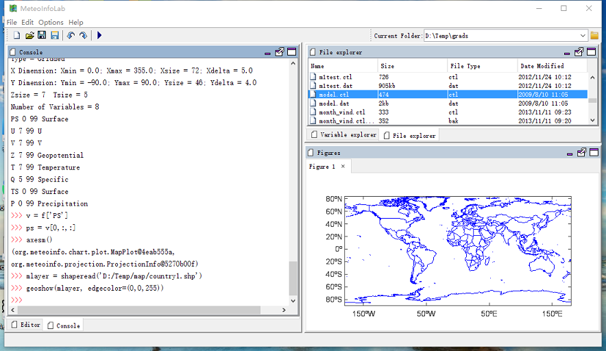
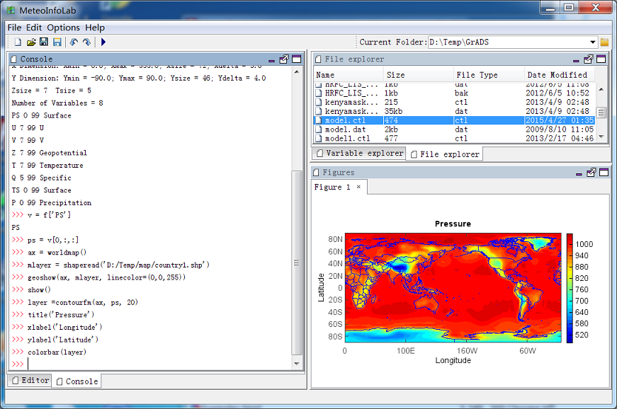

.. _examples-meteoinfolab-tutorial:

**********************
MeteoInfoLab Tutorial
**********************

1. Create data file (netCDF, HDF, GRIB, GrADS, MICAPS, ARL and others) variable using 
'addfile(filename)' function. The path can be omitted if the data file was in the current folder::

  >>> f = addfile('model.ctl')

2. Query data file content including dimensions, attributes and variables by typing the data file 
variable::

  >>> f

.. image:: image/milab_query_file.png

3. Get data variable from data file variable::

  >>> v = f['PS']

4. Get dimension data array from data variable with slice::

  >>> ps = v[0,:,:]

5. Plot map: create a map axes with axesm function; read shape file, view geodata layer::

  >>> axesm()
  >>> mlayer = shaperead('D:/Temp/map/country1.shp')
  >>> geoshow(mlayer, linecolor=(0,0,255))
  

6. Create and plot filled contour layer from the dimension data array (20 is number of contour levels)::

  >>> layer = contourfm(ax, ps, 20)
  
.. image:: image/milab_contourfm.png

7. Add title, x and y labels and colorbar::

  >>> title('Pressure')
  >>> xlabel('Longitude')
  >>> ylabel('Latitude')
  >>> colorbar(layer)
  

8. Save figure::

  >>> savefig('D:/Temp/test/press.png', 400, 300)