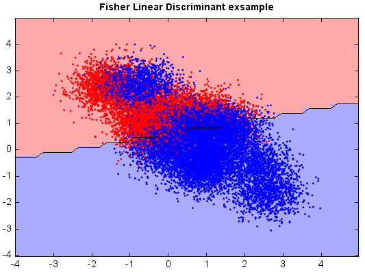

.. _examples-miml-classification-fisher:

****************************
Fisher's linear discriminant
****************************

Fisher's linear discriminant (FLD) is another popular linear classifier. Fisher defined the separation 
between two distributions to be the ratio of the variance between the classes to the variance within 
the classes, which is, in some sense, a measure of the signal-to-noise ratio for the class labeling. 
FLD finds a linear combination of features which maximizes the separation after the projection. The 
resulting combination may be used for dimensionality reduction before later classification.

::

    from miml import datasets
    from miml.classification import FisherLinearDiscriminant

    fn = os.path.join(datasets.get_data_home(), 'classification', 'toy', 
        'toy-test.txt')
    df = DataFrame.read_table(fn, header=None, names=['x1','x2'], 
        format='%2f', index_col=0)

    X = df.values
    y = array(df.index.data)

    fld = FisherLinearDiscriminant(X, y)

    # Plot the decision boundary. For that, we will assign a color to each
    # point in the mesh [x_min, x_max]x[y_min, y_max].
    x_min, x_max = X[:, 0].min() - 1, X[:, 0].max() + 1
    y_min, y_max = X[:, 1].min() - 1, X[:, 1].max() + 1
    n = 50  # size in the mesh
    xx, yy = np.meshgrid(np.linspace(x_min, x_max, n),
                         np.linspace(y_min, y_max, n))
    data = np.vstack((xx.flatten(), yy.flatten())).T
    Z = fld.predict(data)

    # Put the result into a color plot
    Z = Z.reshape(xx.shape)

    #Plot
    # Create color maps
    cmap_light = ['#FFAAAA', '#AAAAFF']
    cmap_bold = ['#FF0000', '#0000FF']
    imshow(xx[0,:], yy[:,0], Z, colors=cmap_light)
    # Plot also the training points
    ls = plt.scatter(X[:, 0], X[:, 1], c=y,
                edgecolor=None, s=3, levels=[0,1], colors=cmap_bold)
    plt.contour(xx[0,:], yy[:,0], Z, [0.5], color='k', smooth=False)
    plt.xlim(xx.min(), xx.max())
    plt.ylim(yy.min(), yy.max())
    plt.title("Fisher Linear Discriminant exsample")
    
