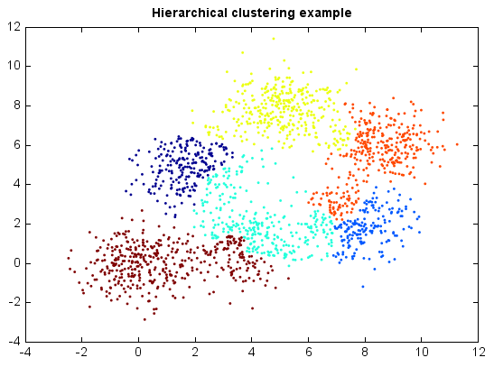

.. _examples-miml-cluster-hclust:

*************************************
Agglomerative Hierarchical Clustering
*************************************

Agglomerative hierarchical clustering seeks to build a hierarchy of clusters in a bottom up 
approach: each observation starts in its own cluster, and pairs of clusters are merged as one moves 
up the hierarchy. The results of hierarchical clustering are usually presented in a dendrogram.

In general, the merges are determined in a greedy manner. In order to decide which clusters should 
be combined, a measure of dissimilarity between sets of observations is required. In most methods 
of hierarchical clustering, this is achieved by use of an appropriate metric, and a linkage criteria 
which specifies the dissimilarity of sets as a function of the pairwise distances of observations 
in the sets.

Hierarchical clustering has the distinct advantage that any valid measure of distance can be used. 
In fact, the observations themselves are not required: all that is used is a matrix of distances.

::

    from miml import datasets
    from miml.cluster import HierarchicalClustering
    from miml.utils import smile_util

    fn = os.path.join(datasets.get_data_home(), 'clustering', 'gaussian', 
        'six.txt')
    df = DataFrame.read_table(fn, header=None, names=['x1','x2'], 
        format='%2f')
    x = df.values

    model = HierarchicalClustering(6, 'complete')
    y = model.fit_predict(x)

    scatter(x[:,0], x[:,1], c=y, edgecolor=None, s=3)
    title('Hierarchical clustering example')
    
