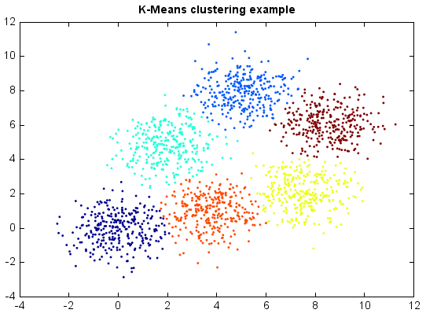

.. _examples-miml-cluster-kmeans:

*************************************
K-Means
*************************************

K-Means clustering partitions n observations into k clusters in which each observation belongs to the 
cluster with the nearest mean. Although finding an exact solution to the K-Means problem for arbitrary 
input is NP-hard, the standard approach to finding an approximate solution (often called Lloyd's 
algorithm or the K-Means algorithm) is used widely and frequently finds reasonable solutions quickly.

K-Means is a hard clustering method, i.e. each sample is assigned to a specific cluster. In contrast, 
soft clustering, e.g. the Expectation-Maximization algorithm for Gaussian mixtures, assign samples to 
different clusters with different probabilities.

K-Means works very well on Gaussian mixtures.

::

    from miml import datasets
    from miml.cluster import KMeans

    fn = os.path.join(datasets.get_data_home(), 'clustering', 'gaussian', 
        'six.txt')
    df = DataFrame.read_table(fn, header=None, names=['x1','x2'], 
        format='%2f')
    x = df.values

    model = KMeans(6, runs=20)
    y = model.fit_predict(x)

    scatter(x[:,0], x[:,1], c=y, edgecolor=None, s=3)
    title('K-Means clustering example')
    

If the clusters are elongated, however, the results may be far from optimal.

::

    from miml import datasets
    from miml.cluster import KMeans

    fn = os.path.join(datasets.get_data_home(), 'clustering', 'gaussian', 
        'elongate.txt')
    df = DataFrame.read_table(fn, header=None, names=['x1','x2'], 
        format='%2f')
    x = df.values

    model = KMeans(2, runs=20)
    y = model.fit_predict(x)

    scatter(x[:,0], x[:,1], c=y, edgecolor=None, s=3)
    title('K-Means clustering example - elongated')
    
.. image:: ../../../_static/miml/kmeans_2.png