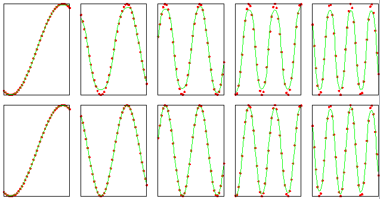

.. _examples-miml-neural_network-fit_sin:

***********
Fit Sine
***********

Sine curve fitting example.

::

    from miml.neural_network import FeedforwardNetwork

    i = 1
    x = arange(-2, 2.01, 0.1)
    hiddensizes = [5,10]
    for hs in hiddensizes:
        print 'Hidden layer size: %i' % hs
        net = FeedforwardNetwork(hs)
        net.layers[0].set_activation('tanh')
        for k in range(1, 6):
            t = sin(k * x)
            net.train(x, t)  
            y = net.predict(x.reshape(len(x), 1))      
            subplot(len(hiddensizes), 5, i)
            i += 1
            plot(x, t, 'r.', x, y, 'g-')
            ylim(-1, 1)
            xticks([])
            yticks([])
    

