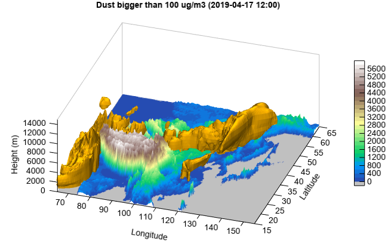

.. _news-meteoinfo_2.0:

******************************************
MeteoInfo 2.0 was released (2019-9-26)
******************************************

  - Add OpenGL support 3D chart functions through JOGL library.
  - Support isosurface 3D plot.
  - Several bug fixed.

Create an OpenGL support 3D axes (Axes3DGL object) using ``axes3dgl`` function. The usage of plot 
functions is similar with Axes3D object.

**Relief surface plot**::

    import time

    #Relief data
    fn = 'D:/Temp/nc/elev.0.25-deg.nc'
    f = addfile(fn)
    elev = f['data'][0,::4,::4]
    lon = elev.dimvalue(1)
    lat = elev.dimvalue(0)
    lon, lat = meshgrid(lon, lat)

    #Plot
    st = time.clock()
    ax = axes3dgl()
    ax.set_lighting(True, position=[0,0,1,0], ambient=[0.2,0.2,0.2,1])
    ls = ax.plot_surface(lon, lat, elev, 20, cmap='MPL_terrain', edge=False)
    zlim(-8000, 20000)
    colorbar(ls,shrink=0.8)
    title('Surface 3D plot example')
    et = time.clock()
    print(et - st)
    
.. image:: ../_static/axes3dgl_relief.png

**Isosurface plot**::

    x = y = z = arange(-3, 3.1, 0.5)
    xx,yy,zz = meshgrid(x, y, z)
    v = xx*exp(-xx**2 - yy**2 - zz**2)

    #Plot
    ax = axes3dgl()
    ax.set_lighting(True, position=[-1,-1,1,1])
    ax.plot_isosurface(x, y, z, v, 1e-5, color='c', edge=False, nthread=4)
    xlim(-3, 3)
    
.. image:: ../_static/axes3dgl_isosurface.png

**3D sand and dust storm plot**::

    #Set date
    sdate = datetime.datetime(2019, 4, 17, 0)

    #Set directory
    datadir = 'D:/Temp/mm5'

    #Read data
    fn = os.path.join(datadir, 'WMO_SDS-WAS_Asian_Center_Model_Forecasting_CUACE-DUST_CMA_'+ sdate.strftime('%Y%m%d%H') + '.nc')
    f = addfile(fn)
    st = f.gettime(0)
    t = 10
    dust = f['CONC_DUST'][t,:,:,:]
    levels = dust.dimvalue(0)
    dust[dust<5] = 0
    height = meteolib.pressure_to_height_std(levels)
    lat = dust.dimvalue(1)
    lon = dust.dimvalue(2)

    #Relief data
    fn = 'D:/Temp/nc/elev.0.25-deg.nc'
    f = addfile(fn)
    elev = f['data'][0,'15:65','65:155']
    elev[elev<0] = -1
    lon1 = elev.dimvalue(1)
    lat1 = elev.dimvalue(0)
    lon1, lat1 = meshgrid(lon1, lat1)

    #Plot
    ax = axes3dgl(bbox=True)
    ax.set_rotation(348)
    ax.set_elevation(-29)
    ax.set_lighting(True)
    levs = arange(0, 6000, 200)
    cols = makecolors(len(levs) + 1, cmap='MPL_terrain')
    cols[0] = 'w'
    ls = ax.plot_surface(lon1, lat1, elev, levs, colors=cols, edge=False)
    ax.plot_isosurface(lon, lat, height, dust, 100, color=[255,180,0,10], \
        edge=False, nthread=4)
    colorbar(ls)
    xlim(65, 155)
    xlabel('Longitude')
    ylim(15, 65)
    ylabel('Latitude')
    zlim(0, 15000)
    zlabel('Height (m)')
    #zticks(arange(len(levels))[1:], levels[1:])
    tt = st + datetime.timedelta(hours=t*3)
    title('Dust bigger than 100 ug/m3 (%s)' % tt.strftime('%Y-%m-%d %H:00'))
    
