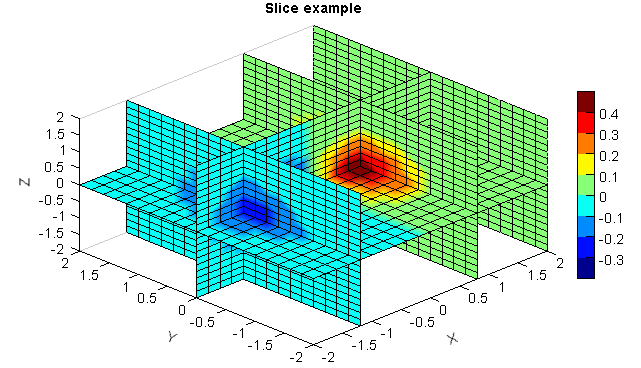

.. _news-meteoinfo_2.2:

******************************************
MeteoInfo 2.2 was released (2020-4-17)
******************************************

  - Update Jython to version 2.7.2.
  - Update time package as Java 8 time package.
  - Add 3D particle and slice plot functions.
  - Add ``FlatLaf`` look and feel.
  - Add ``gridarea`` function in ``migeo`` module for grid cell area calculation.
  - Update bufr data reading functions and add CMA bufr lookup file.
  - Add ``ArrayDate`` class for ``LocalDateTime`` data array.
  - Add getting coordinates array functions for map layer.
  - Update grid data projection function - from backward to forward.
  - Add group path in variable name to avoid name conflict.
  - Add ``split`` and ``array_split`` functions in ``numeric`` module.
  - Add ``delfig`` function in ``miplot`` module.
  - Add ``bincreate`` function in ``midata`` module.

**3D particle plot**::

    #Set date
    sdate = datetime.datetime(2019, 4, 15, 0)

    #Set directory
    datadir = 'D:/Temp/mm5'

    #Read data
    fn = os.path.join(datadir, 'WMO_SDS-WAS_Asian_Center_Model_Forecasting_CUACE-DUST_CMA_'+ sdate.strftime('%Y%m%d%H') + '.nc')
    f = addfile(fn)
    st = f.gettime(0)
    t = 20
    dust = f['CONC_DUST'][t]
    levels = dust.dimvalue(0)
    dust[dust<5] = 0
    height = meteolib.pressure_to_height_std(levels)
    lat = dust.dimvalue(1)
    lon = dust.dimvalue(2)

    #Plot
    cn_layer = shaperead('cn_province')
    world_layer = shaperead('country')
    ax = axes3dgl(bbox=True)
    ax.plot_layer(cn_layer)
    ax.plot_layer(world_layer, edgecolor='b')
    #ax.set_lighting(True, position=[1,1,1,1], mat_specular=[0.5,0.5,0.5,1])
    levs = [50,100,200,300,400,500]
    cmap='WhiteBlueGreenYellowRed'
    #cmap = 'MPL_Oranges'
    pp = ax.plot_particles(lon, lat, height, dust, levs, vmin=20, s=2, \
        cmap=cmap, alpha_min=0.4, alpha_max=0.7, density=3)
    colorbar(pp)
    xlim(65, 155)
    xlabel('Longitude')
    ylim(15, 65)
    ylabel('Latitude')
    zlim(0, 15000)
    zlabel('Height (m)')
    #zticks(arange(len(levels))[1:], levels[1:])
    tt = st + datetime.timedelta(hours=t*3)
    title('Dust concentration ug/m3 (%s)' % tt.strftime('%Y-%m-%d %H:00'))

.. image:: ../_static/particle_3d.png

**3D slice plot**::

    X=Y=Z = arange(-2, 2.1, 0.2)
    X,Y,Z = meshgrid(X, Y, Z)
    V = X*exp(-X**2-Y**2-Z**2)

    xslice = [-1.2,0.8,2]
    yslice = [0]
    zslice = 0
    ax = axes3dgl()
    gs = ax.plot_slice(X,Y,Z,V,xslice=xslice,yslice=yslice,zslice=zslice)
    colorbar(gs[0])
    title('Slice example')

