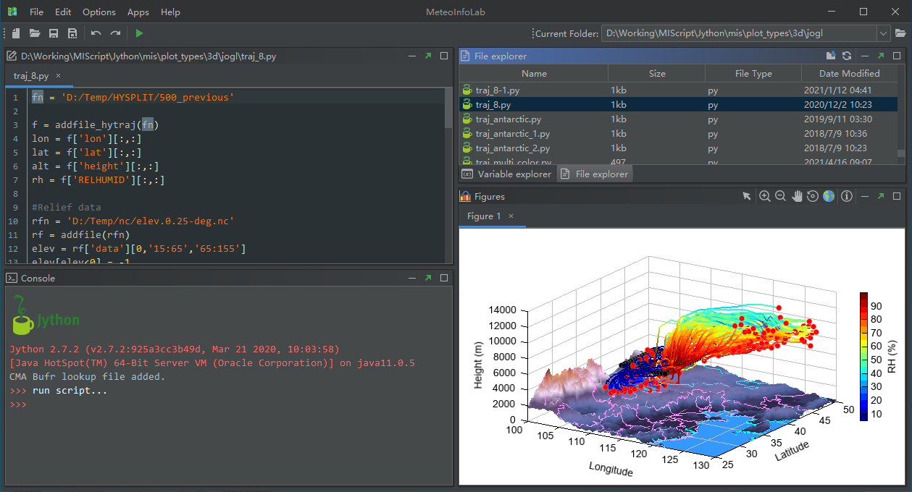

.. _news-meteoinfo_2.3:

******************************************
MeteoInfo 2.3 was released (2020-8-24)
******************************************

  - Using SVG icons in GUI.
  - Update netCDF java library to 5.3.3.
  - Update FlatLaf to 0.40.
  - Update jts to version 1.17.0.
  - Update proj4j to version 1.1.2-SNAPSHOT
  - Add dpi support for output image of JOGL 3D.
  - Add zoom and move events to 3d jogl plot.
  - Add PolygonZ shape type support.
  - Add ``ddof`` argument in std and var functions.
  - Add ``ceil`` and ``floor`` functions.
  - Add 3d griddata idw and nearest methods support.
  - Re-arrange meteolib's packages and modules.

**New GUI of MeteoInfoLab**

**New GUI of MeteoInfoMap**

.. image:: ../_static/news/mimap_2.3.PNG
   :scale: 50