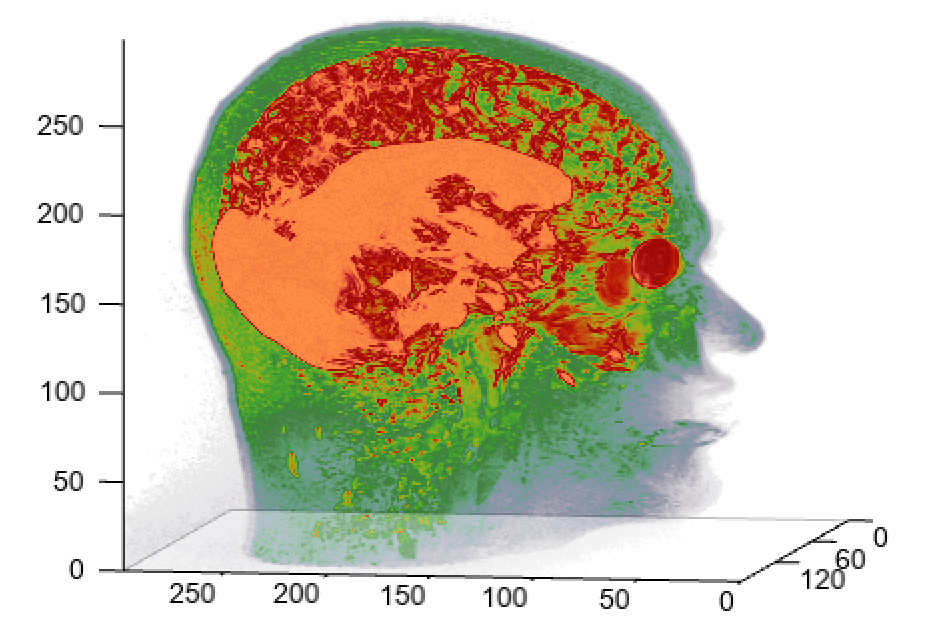

.. _news-meteoinfo_3.1.0:

******************************************
MeteoInfo 3.1.0 was released (2021-7-25)
******************************************

  - Add 3d volume plt function - `volumeplot`
  - Update FlatLaf to version 1.4
  - Add fixed_point function in optimize sub-package
  - Add `extract`, `mod`, `fmod`, `floor_divide`, `divmod`, `searchsorted` functions
  - Update geotiff reading function to support bigtiff format
  - Support netcdf4 data writing of `ncwrite` function - c version netcdf4 lib should be installed
  - Using juniversalchardet library to detect file encoding
  - Add Rectangle linear and nearest interpolation functions
  - Some bug fixed

**3D volume plot**::

    fn = 'D:/Temp/image/sagittal.png'
    data1 = imagelib.imread(fn)
    data1 = data1[:,:,0]
    data1 = data1.reshape(88,300,600)
    data = zeros([176,300,300], dtype='int')
    data[:88] = data1[::-1,:,:300]
    data[88:] = data1[::-1,:,300:]
    data = data.swapaxes(0, 1)

    ax = axes3d()
    ax.set_draw_box(False)
    grid(False)
    volumeplot(data, cmap='NCV_bright')

