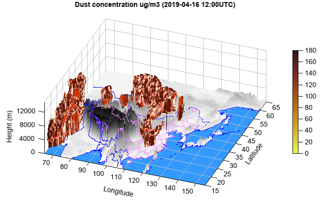

.. _news-meteoinfo_3.3.0:

******************************************
MeteoInfo 3.3.0 was released (2022-2-14)
******************************************

  - Add earth sphere 3D axes
  - Add ``xyslice`` argument in slice3, contoursclice, contourfslice and streamslice functions
  - Support image texture rendering in ``surf`` function
  - Update ``volumeplot`` function with ray casting algorithms of ``basic``, ``max_value`` and ``specular``
  - Add ``sinh``, ``cosh`` and ``tanh`` functions
  - improve ``meteolib`` functions
  - Improve image output functions with tif file support
  - Add GeoQ web tile maps
  - Add Yahei hybrid font
  - Support micaps data file with BOM using Apache commons io library
  - Update pro4j to 1.1.4
  - Update FlatLaf to version 2.0.1
  - Some bug fixed

**volume plot with ``specular`` ray casting and transfer function**::

    #Set date
    sdate = datetime.datetime(2019, 4, 15, 0)

    #Set directory
    datadir = 'D:/Temp/mm5'

    #Read data
    fn = os.path.join(datadir, 'WMO_SDS-WAS_Asian_Center_Model_Forecasting_CUACE-DUST_CMA_'+ sdate.strftime('%Y%m%d%H') + '.nc')
    f = addfile(fn)
    st = f.gettime(0)
    t = 12
    dust = f['CONC_DUST'][t,:,'15:65','65:155']
    levels = dust.dimvalue(0)
    dust[dust==nan] = 0
    height = meteolib.pressure_to_height_std(levels)
    lat = dust.dimvalue(1)
    lon = dust.dimvalue(2)

    #Relief data
    rfn = 'D:/Temp/nc/elev.0.25-deg.nc'
    rf = addfile(rfn)
    elev = rf['data'][0,'15:65','65:155']
    elev[elev<0] = -1
    lon1 = elev.dimvalue(1)
    lat1 = elev.dimvalue(0)
    lon1, lat1 = meshgrid(lon1, lat1)

    #Map
    lchina = shaperead('cn_province')
    clon = lchina.x_coord
    clat = lchina.y_coord
    calt = zeros(len(clon))
    h = interp2d(elev, clon, clat)
    calt = calt + h
    lworld = shaperead('country')
    wlon = lworld.x_coord
    wlat = lworld.y_coord
    walt = zeros(len(wlon))
    h = interp2d(elev, wlon, wlat)
    walt = walt + h

    #Plot
    ax = axes3d(clip_plane=False)
    ax.set_elevation(-20)
    ax.set_rotation(335)
    rlevs = arange(0, 6000, 200)
    cols = makecolors(len(rlevs) + 1, cmap='MPL_gist_yarg', alpha=1)
    cols[0] = [51,153,255]
    surf(lon1, lat1, elev, rlevs, facecolor='interp', colors=cols, edge=False)
    plot3(clon, clat, calt, color=[255,153,255])
    plot3(wlon, wlat, walt, color='b')
    #Beijing location
    plot3([116.39,116.39], [39.91,39.91], [0,12000])
    pp = volumeplot(lon, lat, height, dust, ray_casting='specular',
        cmap='cmocean_solar_r', vmax=180, brightness=2.5,
        opacity_nodes=[90,100,120,121], opacity_levels=[0,0.5,0.5,0])
    colorbar(pp, aspect=30)
    xlim(65, 155)
    xlabel('Longitude')
    ylim(15, 65)
    ylabel('Latitude')
    zlim(0, 15000)
    zlabel('Height (m)')
    tt = st + datetime.timedelta(hours=t*3)
    title('Dust concentration ug/m3 ({}UTC)'.format(tt.strftime('%Y-%m-%d %H:00')))

**Stream slice on 3D earth**::

    fn = os.path.join(migl.get_sample_folder(), 'GrADS', 'model.ctl')
    f = addfile(fn)
    u = f['U'][0]
    v = f['V'][0]
    levels = u.dimvalue(0)
    height = meteolib.pressure_to_height_std(levels) / 10
    lat = u.dimvalue(1)
    lon = u.dimvalue(2)
    w = zeros(u.shape)
    speed = sqrt(u*u + v*v)

    ax = axes3d(projection='earth')
    geoshow('country', edgecolor='gray')
    levs = arange(2, 20, 2)
    streamslice(lon, lat, height, u, v, w, speed, levs=levs, zslice=[300],
        interval=10)
    colorbar(tickcolor='w', xshift=80)

.. image:: ../_static/earth_streamslice.jpg

**isentropic_analysis**::

    fn = 'D:/Temp/nc/narr_example.nc'
    f = addfile(fn)
    pres = f['isobaric'][:]
    tmpk = f['Temperature'][:]
    u_wind = f['u_wind'][:]
    v_wind = f['v_wind'][:]
    sh = f['Specific_humidity'][:]
    y = tmpk.dimvalue(-2)
    x = tmpk.dimvalue(-1)

    isentlevs = [296.]
    pres, tmpk, u_wind, v_wind, sh = meteolib.isentropic_interpolation(isentlevs, pres,
        tmpk, u_wind, v_wind, sh, temperature_out=True)
    rh = meteolib.relative_humidity_from_specific_humidity(pres, tmpk, sh) * 100

    #plot
    axesm(projinfo=f.proj)
    geoshow('us_states')
    geoshow('country')
    # Plot rh
    levs = arange(10., 106, 5)
    grh = contourf(x, y, rh[0], levs, cmap='MPL_gist_earth_r', proj=f.proj)
    colorbar(grh, orientation='horizontal', aspect=40, shrink=0.8,
        label='Relative Humidity')
    # Plot the surface
    clevisent = arange(0, 1000, 25)
    cs = contour(x, y, pres[0], clevisent, colors='k', linewidths=1.0, proj=f.proj)
    clabel(cs, fontsize=10, fmt='%i', drawshadow=False)
    # Plot wind barbs
    xx, yy = meshgrid(x, y)
    wind_slice = slice(None, None, 6)
    barbs(xx[wind_slice,wind_slice], yy[wind_slice,wind_slice], u_wind[0,wind_slice,wind_slice], v_wind[0,wind_slice,wind_slice],
        size=6, proj=f.proj)

    axis([-122, -75, 25, 50])

.. image:: ../_static/isentropic_analysis.png