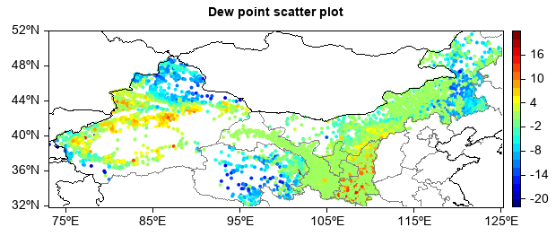

.. _news-meteoinfo_3.4:

******************************************
MeteoInfo 3.4 was released (2022-8-12)
******************************************

  - Add unsigned short and int arithmetic functions in ArrayMath class
  - Support drawing extra z axis in 3D axes
  - Add axes_zoom argument in axes3d function
  - Add status toolbar with run and memory progress bars in MeteoInfoLab GUI
  - Add popup menu to file dockable
  - Add labelshift argument in colorbar function
  - Add skew and kurtosis functions in stats module
  - Add fimplicit3 plot function
  - Add __and__, __or__, __xor__ operations in Series class
  - Add replace function in DataFrame and Series classes
  - Improve drop function in DataFrame to support rows drop
  - Add fill plot function
  - Add multivariate_normal function
  - Add ColorTransferFunction class
  - Support vertical boxplot
  - Support MICAPS MDFS type 12 data file
  - Add MeshRender and SurfaceRender classes for vbo rendering
  - Update netcdf-java to version 5.5.3
  - Update FlatLaf to version 2.4
  - Update joml to version 1.10.4
  - Update rsyntaxtextarea to version 3.2.0
  - Update ojAlgo to version 51.3.0
  - Update l2fprod to version 6.9.1
  - Update jts to version 1.19.0
  - Update jython to version 2.7.3b1
  - Update Apache commons math to version 4.0-SNAPSHOT from 3.6.1
  - Some bug fixed

**Plot 3-D implicit function**::

    def f(x, y, z):
        return sin(x) * cos(y) + sin(y) * cos(z) + sin(z) * cos(x)

    axes3d(aspect='equal', axes_zoom=True)
    lighting()
    fimplicit3(f, [-2*pi,2*pi], facecolor='y', edgecolor='k')

.. image:: ../_static/fimplicit3_gyroid.png

**Read and plot MICAPS MDFS type 12 data file**::

    fn = 'D:/Temp/micaps/mdfs/20220509153000.000'
    f = addfile_micaps(fn)
    df = f.read_dataframe()
    lon = df['Longitude'].values
    lat = df['Latitude'].values
    t = df['DewPoint'].values

    geoshow('cn_province', edgecolor='gray')
    geoshow('country')
    levs = arange(-20, 21, 2)
    scatter(lon, lat, t, levs, size=4, edgecolor=None, zorder=0)
    colorbar()
    title('Dew point scatter plot')

