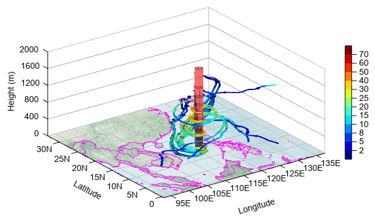
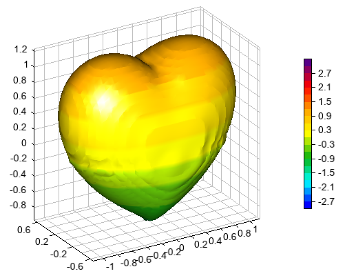

.. _news-meteoinfo_3.4:

******************************************
MeteoInfo 3.5 was released (2022-12-26)
******************************************

  - Add LineRender and PipeRender to plot 3D lines with VBO
  - Add QuiverRender to plot 3D quivers with VBO
  - Add imageio-jpeg 3.9.4 to support JPEG file with CMYK color profile
  - Add get_dbz function in wrf package
  - Add real and imag attributes in NDArray
  - Add conj and conjugate functions
  - Add material function for lighting setting
  - Add deg2rad and rad2deg functions
  - Add prod and cumprod functions
  - update isosurface function for smooth normal calculation and color array supported
  - Support multiple GL plots in a figure
  - Support China radar standard base data format
  - Support read_dataframe function for MICAPS 3 dataset
  - Support trajectory frequency data file for HYSPLITConcDataInfo readDataInfo function
  - Support MICAPS data files for addfile function
  - Support calibration table data in AWX data format
  - Update ejml to version 0.41.1
  - Update FlatLaf to version 3.0
  - Update commons-math to version 4.0-beta1
  - Update commons-number to version 1.1
  - Update commons-rng to version 1.5
  - Update commons-statistics to version 1.0
  - Update rsyntaxtextarea to version 3.3.1
  - Update proj4j to version 1.2.2
  - Update ojAlgo to version 51.4.1
  - Update jython to version 2.7.3
  - Bugfix for TextRender memory leak
  - Some other bugs fixed

**Plot 3-D stream lines around typhoon center**::

    clear()
    print('Read data...')
    fn = r'D:\Temp\LaSW\airship\T_raps\wrfout_d01_2020-10-26_18_00_00'
    f = addfile(fn)
    tidx = 0
    tt = f.gettime(tidx)
    ss = 5
    u = f['U'][tidx]
    v = f['V'][tidx]
    w = f['W'][tidx]
    u = meteo.wrf.destagger(u, -1)
    v = meteo.wrf.destagger(v, -2)
    w = meteo.wrf.destagger(w, -3)
    w = w * 2
    speed = sqrt(u*u + v*v + w*w)
    nz, ny, nx = u.shape
    y = u.dimvalue(1)
    x = u.dimvalue(2)
    height1 = meteolib.wrf.get_height(f, tidx)
    height = height1[:,0,0]
    speed = sqrt(u*u + v*v + w*w)
    x1, y1, _ = meshgrid(x, y, arange(nz))

    sz, sy, sx = where(speed[:10]>25)

    print('Plot...')
    axes3d(projection=f.proj)
    lighting()
    geoshow('eo_base.jpg', lighting=False)
    geoshow('country', edgecolor='m', lighting=False)
    isosurface(x, y, height, speed, 50, facecolor=[255,51,51], \
        edgecolor=None, alpha=0.7, nthread=4)
    idx = speed[0].argmax()
    idx = unravel_index(idx, speed[0].shape)
    xx = x[idx[1]-1:idx[1]+2]
    yy = y[idx[0]-1:idx[0]+2]
    zz = [100, 200, 500, 800, 1000]
    xx, yy, zz = meshgrid(xx, yy, zz)
    xstart = xx
    ystart = yy
    zstart = zz
    levs = [2,5,8,10,15,20,25,30,40,50,60,70]
    qq = streamplot3(x, y, height, u, v, w, speed, levs=levs, density=2, linewidth=2,
        interval=100, nloop=1000, start_x=xstart, start_y=ystart,
        start_z=zstart, pipe=True, radius=0.01, lighting=True, cmap='matlab_jet')
    colorbar(aspect=30)
    xlim(x[0], x[-1])
    ylim(y[0], y[-1])
    zlim(0, 2000)
    xlabel('Longitude')
    ylabel('Latitude')
    zlabel('Height (m)')
    antialias()

**isosurface with color data array**::

    a = linspace(-3, 3, 100)
    x,y,z = meshgrid(a, a, a)
    p = (x**2+(9/4.)*y**2+z**2-1)**3-x**2*z**3-(9/80.)*y**2*z**3
    axes3d(aspect='equal', axes_zoom=True)
    lighting(mat_specular=1)
    isosurface(x, y, z, p, 0, z, 20, cdata=z, cmap='BlAqGrYeOrReVi200')
    colorbar(xshift=50)

