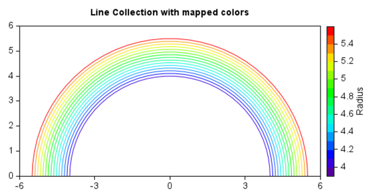
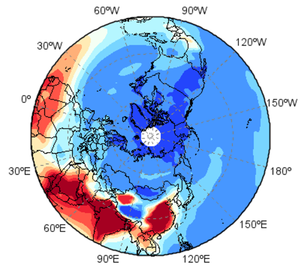

.. _news-meteoinfo_3.9:

******************************************
MeteoInfo 3.9 was released (2024-7-25)
******************************************

  - Add Point2DCollection, LineCollection classes
  - Add ·makemarkers· function
  - Add Transform for graphics
  - Add `avoidcoll` argument in barbs, quiver and stationmodel functions
  - Add `crs` module and some common used projections in `geolib` package
  - Add `velocity_potential` and `stream_function` functions
  - Add `magic`, `convolve` functions
  - Add `Rotation` class for 3-D rotation of vectors
  - Support long type data math operators
  - Add `_eof` sub-package for EOF analysis
  - Add `isin` function in DataFrame and Series
  - Support CA/CB, SA/SB, SC, PA, CC radar data file
  - Update netcdf-java to version 5.6.0
  - Update flatlaf to version 3.5
  - Update rsyntaxtextarea to version 3.4.0
  - Some other bugs fixed

LineCollection example
______________________

::

    # create a list of half-circles with varying radii
    num_arcs = 15
    theta = np.linspace(0, np.pi, 36)
    radii = np.linspace(4, 5.5, num=num_arcs)
    arcs = [np.column_stack([r * np.cos(theta), r * np.sin(theta)]) for r in radii]

    lines = plt.LineCollection(arcs, array=radii, cmap='rainbow', antialias=True)
    ax = axes(aspect='equal')
    ax.add_graphic(lines)
    ylim(0, 6)
    colorbar(lines, label='Radius')
    title('Line Collection with mapped colors')

Create map axes with given projection
_____________________________________

*Robinson projection*

::

    axesm(projection=geolib.Robinson(), axison=False, frameon=False)
    grid(True, tickvisible=True, tickposition='all', fontsize=12)
    geoshow('country', facecolor='lightgray')
    xticks(arange(-180, 181, 60))
    yticks(arange(-60, 61, 30))
    axis()

*Lambert conformal projection*

::

    proj = geolib.LambertConformal(central_longitude=104.35, cutoff=0)
    ax = axesm(projection=proj, frameon=False, axison=False)
    geoshow('country', facecolor='lightgray')
    grid(color='b', alpha=0.7, tickvisible=True, tickposition='all',
        tickfont=dict(size=12))
    xticks(arange(-180, 181, 30))
    yticks(arange(0, 61, 30))
    axis()

.. image:: ../_static/proj_lambert.png

*North polar stereographic projection*

::

    f = addfile(r'D:\Temp\nc\Mulyimean_AOD_2007_2019-D_N_mean.nc')
    aod = f['TAOD'][:]
    lat = f['lat'][:]
    lon = f['lon'][:]
    lon = np.append(lon, [lon[-1] + 5])
    aod = np.append(aod, aod[:,0][:,np.newaxis], axis=1)

    proj = geolib.NorthPolarStereo(central_longitude=105, cutoff=10)
    axesm(projection=proj, axison=False, frameon=False)
    geoshow('country')
    levels = arange(0,0.5,0.05)
    layer = contourf(lon, lat, aod, levels, extend='both', cmap='BlueDarkRed18', transform=geolib.PlateCarree())
    grid(True, color='gray', tickvisible=True, tickposition='all')
    xticks(arange(-180, 181, 30))
    yticks([30, 60])
    axis()

