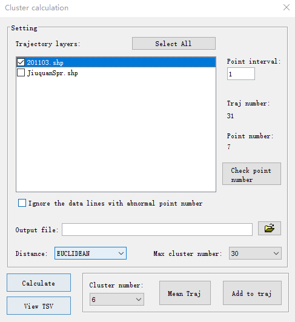

.. _news-trajstat_1.4.5:

******************************************
TrajStat 1.4.5 was released (2018-6-1)
******************************************

  - Add `Check point number` button in cluster calculation dialog to check the end point number of each trajectory.
  - Add 3D trajectory chart to explore the trajectories in 3D view.
  - Add `Save to grid` menu item to save PSCF/CWT data in a Sufer ASCII grid data file, which can be loaded and plot as a contour layer.

**Check point number**

**3D trajectory chart**

.. image:: ../_static/news/trajstat_1.4.5_3d.png

**Sav to grid data file**

.. image:: ../_static/news/trajstat_1.4.5_savegrid.png