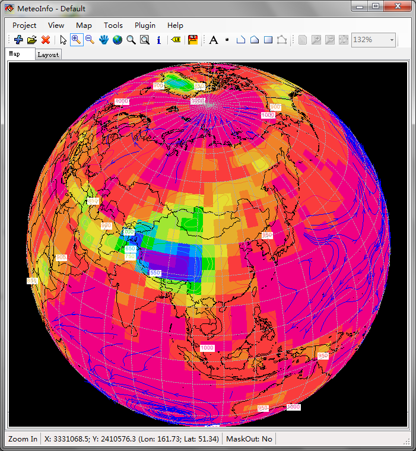
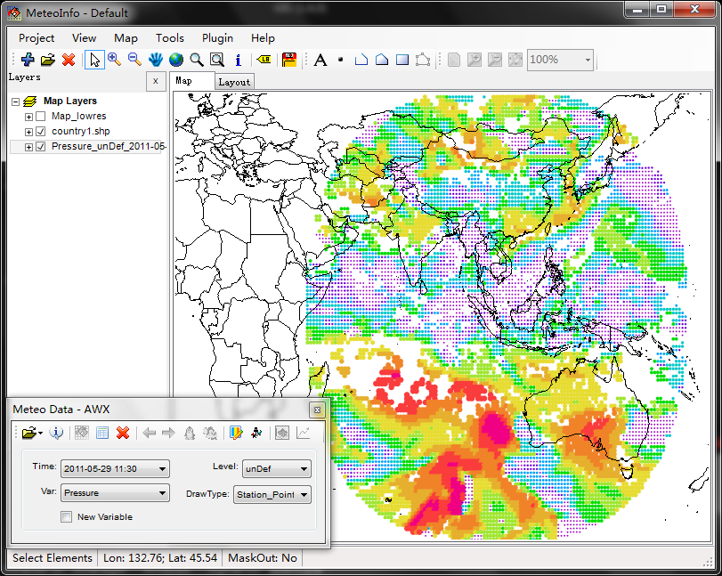
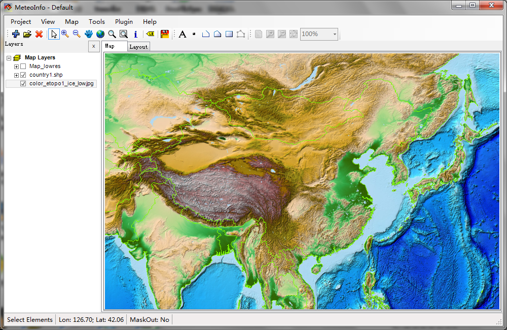
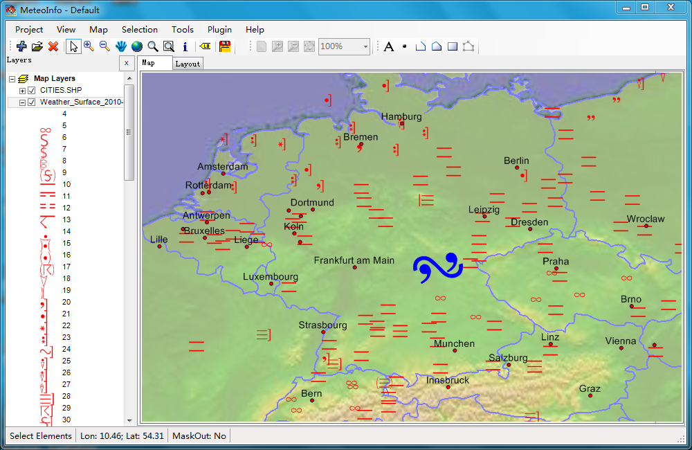
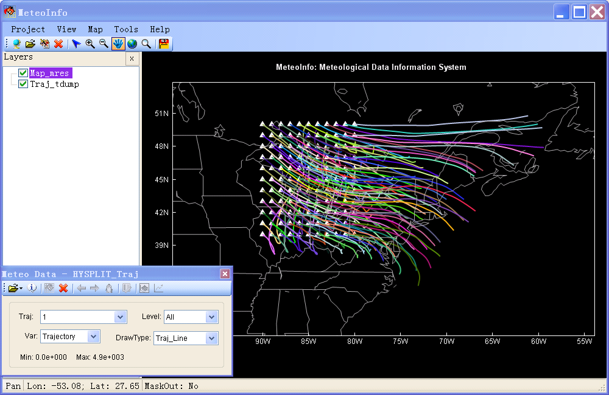

.. _products-meteoinfo:

MeteoInfo
=======================

Introduction
------------------------------------
MeteoInfo is an open source software (LGPL license) designed to view and analyze meteorological and spatial 
data interactively. Some GIS functions were developed from ground level. It has two editions: 
Java and C#. MeteoInfo may be run in Windows, Mac OS, Linux and Unix. MeteoInfo can also be run 
automatically using MeteoInfo scripting with the Jython language (Java edition) or IronPython 
language (C# edition). The main functions are packed in the MeteoInfo class library, which could 
be used to conveniently develop the software.

MeteoInfoLab is an open source software (LGPL license) product developed using Java and Jython based on MeteoInfo Java 
library (Unidata netCDF Java library is used). The purpose is to provide an optional scientific 
computation and visualization tool similar with MatLab and/or NCL.

Publication
-------------------------------------
  - Wang, Y. Q. 2014. MeteoInfo: GIS software for meteorological data visualization and analysis. Meteorological Applications, 21: 360-368.

Source code
---------------
https://github.com/meteoinfo
  
Supported meteorological data formats
--------------------------------------
  - GrADS binary grid and station data 
  - NetCDF grid data 
  - GRIB edition 1 and 2 data
  - HDF EOS5 data
  - ARL packed meteorological data 
  - HYSPLIT model output data: concentration, particle and trajectory 
  - METAR data (special for the cycle METAR data of NOAA, http://weather.noaa....her/metar.shtml ) 
  - NOAA ISH data 
  - Lon/Lat Station ASCII data 
  - MICAPS 1, 3, 4, 7, 11 and 13 format data 
  - ASCII Grid data 
  - Surfer Grid data 
  - AWX satellite data
  
Supported Map and Image Data
------------------------------------
  - ESRI shape file with point, polyline or polygon shape type. Projected shape file was not supported at present. 
  - Geographic map data of GrADS. 
  - Geographic map data of MICAPS. 
  - wmf map data. (Can be created by "Output Map Data" function in MeteoInfo) 
  - Normal Image data: Bmp, Jpg, Gif, Tiff, Png

Plot options of grid data
-----------------------------------
  - Contour 
  - Shaded 
  - Grid Fill 
  - Grid Point 
  - Vector 
  - Barb 
  - Raster 
  - Streamline

Plot options of station data
--------------------------------------
  - Station Point 
  - Contour 
  - Shaded 
  - Barb 
  - Weather Symbol 
  - Station Model 
  - Station Info 

Plot options of line data (trajectory, typhoon, etc)
-------------------------------------------------------
  - TrajLine 
  - TrajStartPoint 
  - TrajPoint
  
Screen shots
-------------------

.. image:: meteoinfo_image/MeteoInfo_2.png
   :scale: 50

.. image:: meteoinfo_image/MeteoInfo_4.png
   :scale: 50

.. image:: meteoinfo_image/MeteoInfo_6.png
   :scale: 50
.. image:: meteoinfo_image/MeteoInfo_7.png
   :scale: 50
.. image:: meteoinfo_image/MeteoInfo_8.png
   :scale: 50
.. image:: meteoinfo_image/MeteoInfo_9.png
   :scale: 50
.. image:: meteoinfo_image/MeteoInfo_10.png
   :scale: 50

.. image:: meteoinfo_image/MeteoInfo_12.png
   :scale: 50
.. image:: meteoinfo_image/MeteoInfo_13.png
   :scale: 50
.. image:: meteoinfo_image/MeteoInfo_14.png
   :scale: 50

.. image:: meteoinfo_image/MeteoInfo_16.png
   :scale: 50